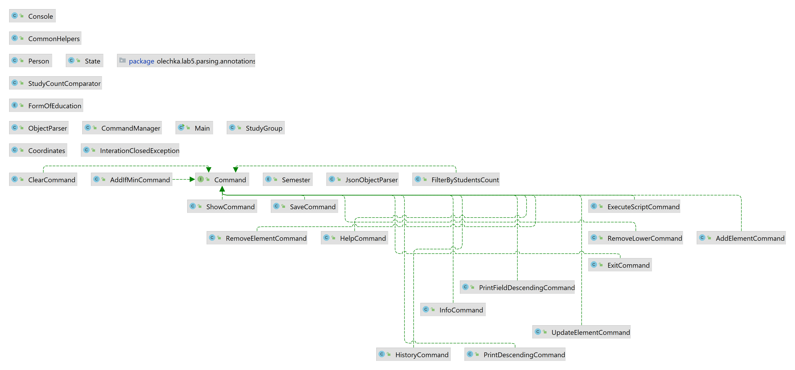

# Лабораторная работа №5

**Цель лабораторной работы:**
Реализовать консольное приложение, которое реализует управление коллекцией объектов в интерактивном режиме. В коллекции
необходимо хранить объекты класса **StudyGroup**, описание которого приведено ниже.

**Разработанная программа должна удовлетворять следующим требованиям:**

1. Класс, коллекцией экземпляров которого управляет программа, должен реализовывать сортировку по умолчанию.
2. Все требования к полям класса (указанные в виде комментариев) должны быть выполнены.
3. Для хранения необходимо использовать коллекцию типа `java.util.LinkedHashSet`
4. При запуске приложения коллекция должна автоматически заполняться значениями из файла.
5. Имя файла должно передаваться программе с помощью: **аргумент командной строки**.
6. Данные должны храниться в файле в формате `json`
7. Чтение данных из файла необходимо реализовать с помощью класса `java.io.InputStreamReader`
8. Запись данных в файл необходимо реализовать с помощью класса `java.io.BufferedWriter`
9. Все классы в программе должны быть задокументированы в формате `javadoc`.
10. Программа должна корректно работать с неправильными данными (ошибки пользовательского ввода, отсутсвие прав доступа
    к файлу и т.п.).

**В интерактивном режиме программа должна поддерживать выполнение следующих команд:**

* `help` : вывести справку по доступным командам
* `info` : вывести в стандартный поток вывода информацию о коллекции (тип, дата инициализации, количество элементов и
  т.д.)
* `show` : вывести в стандартный поток вывода все элементы коллекции в строковом представлении
* `add {element}` : добавить новый элемент в коллекцию
* `update id {element}` : обновить значение элемента коллекции, id которого равен заданному
* `remove_by_id id` : удалить элемент из коллекции по его id
* `clear` : очистить коллекцию
* `save` : сохранить коллекцию в файл
* `execute_script file_name` : считать и исполнить скрипт из указанного файла. В скрипте содержатся команды в таком же
  виде, в котором их вводит пользователь в интерактивном режиме.
* `exit` : завершить программу (без сохранения в файл)
* `add_if_min {element}` : добавить новый элемент в коллекцию, если его значение меньше, чем у наименьшего элемента этой
  коллекции
* `remove_lower {element}` : удалить из коллекции все элементы, меньшие, чем заданный
* `history` : вывести последние 14 команд (без их аргументов)
* `filter_by_students_count studentsCount` : вывести элементы, значение поля studentsCount которых равно заданному
* `print_descending` : вывести элементы коллекции в порядке убывания
* `print_field_descending_students_count` : вывести значения поля studentsCount всех элементов в порядке убывания

**Формат ввода команд:**

* Все аргументы команды, являющиеся стандартными типами данных (примитивные типы, классы-оболочки, String, классы для
  хранения дат), должны вводиться в той же строке, что и имя команды.
* Все составные типы данных (объекты классов, хранящиеся в коллекции) должны вводиться по одному полю в строку.
* При вводе составных типов данных пользователю должно показываться приглашение к вводу, содержащее имя поля (
  например, "Введите дату рождения:")
* Если поле является enum'ом, то вводится имя одной из его констант (при этом список констант должен быть предварительно
  выведен).
* При некорректном пользовательском вводе (введена строка, не являющаяся именем константы в enum'е; введена строка
  вместо числа; введённое число не входит в указанные границы и т.п.) должно быть показано сообщение об ошибке и
  предложено повторить ввод поля.
* Для ввода значений null использовать пустую строку.
* Поля с комментарием "Значение этого поля должно генерироваться автоматически" не должны вводиться пользователем
  вручную при добавлении.

**Описание хранимых в коллекции классов:**

```java
public class StudyGroup {
    private Long id; //Поле не может быть null, Значение поля должно быть больше 0, Значение этого поля должно быть уникальным, Значение этого поля должно
    private String name; //Поле не может быть null, Строка не может быть пустой
    private Coordinates coordinates; //Поле не может быть null
    private java.time.LocalDateTime creationDate; //Поле не может быть null, Значение этого поля должно генерироваться автоматически
    private Long studentsCount; //Значение поля должно быть больше 0, Поле не может быть null
    private long transferredStudents; //Значение поля должно быть больше о
    private FormofEducation formofEducation; //Поле не может быть null
    private Semester semesterEnum; //Поле может быть null
    private Person groupAdmin; //Поле может быть null
}

public class Coordinates {
    private Integer x; //значение поля должно быть больше -47, Поле не может быть null
    private Double y;
}

public class Person {
    private String name; //Поле не может быть null, Строка не может быть пустой
    private java.time.LocalDate birthday; //Поле может быть null
    private long height; //Значение поля должно быть больше о
    private Long weight; //Поле может быть null, значение поля должно быть больше о
    private String passportID;//Значение этого поля должно быть уникальным, Поле может быть null
}

public class Person {
    private String name; //Поле не может быть null, Строка не может быть пустой
    private java.time.LocalDate birthday; //Поле может быть null
    private long height; //Значение поля должно быть больше о
    private String passportID; //Значение этого поля должно быть уникальным, Поле может быть null
}

public enum FormOfEducation {
    DISTANCE_EDUCATION,
    FULL_TIME_EDUCATION,
    EVENING_CLASSES;
}

public enum Semester {
    FIRST,
    FIFTH,
    SIXTH,
    SEVENTH;
}
 ```

## Как это было реализовано:

Для того, чтобы скрыть реализацию команд (к примеру, `add` - добавить элемент коллекции, `clear` - очистить
элементы коллекции и т.д.), а также объединить их одним интерфейсом для повышения читаемости и расширяемости кода, был
применен паттерн **Command**.

Каждый объект команды содержит в себе поля - аргументы этой команды, а также методы:

* execute(): исполняет эту команду в контексте заданного **state**(далее о нем ниже).
* parse(): принимает объект **Console** и используется, чтобы считывать свои аргументы из консоли.

Общее состояние программы представляется объектом класса **State**, который
создается лишь один раз при запуске программы.
В нем хранится сама коллекция, счетчик следующего **id**, имя файла сохранения и объект **CommandManager**.

**CommandManager** может создавать команды по их названию, хранит справку(**help**), а также историю последних команд(*
*history**)
и список текущих исполняющихся скриптов, чтобы не допустить рекурсии при их выполнении.

Для взаимодействия с пользователем используется объект **Console**. Он не является
частью общего состояния **State**, но также создается при запуске программы. Также
он может создаваться при выполнении команды **execute_script**, чтобы имитировать пользовательский ввод.

Некоторые команды могут запрашивать у пользователя или выводить ему объекты коллекции.
Для этого используется класс **ObjectParser**. Его метод **createInteractive()**
получает **Class** требуемого объекта и затем либо напрямую получает строку из консоли и создает объект(для примитивов,
перечислений и стандартных классов), либо запрашивает значение каждого поля, заполняя создаваемый объект (для объектов
коллекций). Во втором случае также выполняется валидация.
Для получения списка полей и их названий и для валидации используется рефлексия и аннотации:

* **HumanDescription** - позволяет указать название поля и его формат, понятные пользователю.
* **NonNull** - запрещает null-значение поля.
* **IgnoreInput** - пропускает поле при заполнении объекта, используется для автогенерируемых полей, которые
  пользователь не вводит.
* **BiggerThan** - указывает, что поле должно быть больше какого-либо значения, используется для валидации числовых
  полей.
* **SmallerThan** - аналогично **BiggerThan** указывает, что поле должно быть меньше какого-либо значения.

Также у **ObjectParser** есть метод **printObject()**, который создает из объекта строку-описание. Он работает
аналогично **createInteractive()**, используя рефлексию, но не запрашивает поля, а печатает их.

Программа предполагает возможность загрузки и сохранения коллекции в файл формата **json**.
Для работы с таким форматом используется библиотека **org.json**, которая предоставляет json-примитивы **JSONArray** и *
*JSONObject**.
Для преобразования объектов коллекции в **JSONObject** и обратно создан класс **JsonObjectParser**. Он работает
аналогично **ObjectParser** и тоже использует
рефлексию. Создание и сохранение **JSONArray** с элементами коллекции происходит в **SaveCommand.execute()**. Загрузка
массива происходит при запуске программы еще в **main**.

## Диаграмма классов реализованной объектной модели.



